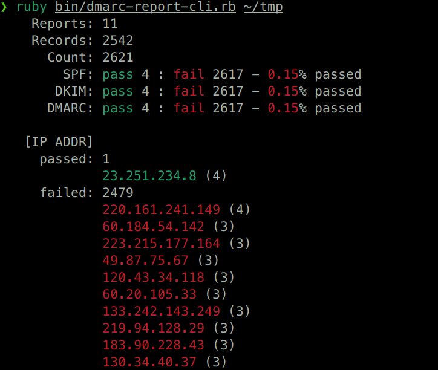

# dmarc-report-tools

## Synopsis

Lightweight command-line tools for inspecting DMARC aggregate reports directly in the terminal.

## Screenshot



## Dependency

* Zsh
* ripmime
* ar (`unar`(1))
* Ruby
    * Nokogiri Gem

## Usage

### Extract DMARC XMLs from e-mails

```
dmarc-extract-xmls.zsh <mail_directory> <dest_directory>
```

`mail_directory`: A directory containing complete email files. This can be an MH-style mail folder or a directory of `.eml` files. Each file is expected to be a full RFC822 email message.

`dest_directory`: A directory where extracted DMARC XML reports will be saved. ⚠️ **It is strongly recommended to use an empty directory.** The script will delete all non-DMARC files during extraction. If you specify a directory that already contains files, they may be removed.

### Analyze DMARC XMLs

```
dmarc-report-cli.rb [-C] [-O summary|stream|sourceip|domain|from|json] [-d <domain>] <reports_directory>
```

This CLI tool reads DMARC XML files from a specified directory and outputs analysis results in various formats.  
Most output formats use ANSI color and are intended for terminal display.

`<reports_directory>` should contain DMARC XML files extracted from email reports.

The tool will parse all files in the directory and generate output based on the selected format.

#### No color (`-C` / `--nocolor`)

Disable ANSI color escape sequence in output.

#### Output Formats (`-O` / `--output-formats`)

Use the `-O` or `--output-formats` option to specify the desired output format.

##### `summary` (default)

Displays a general overview including:

- Total number of records
- Pass/fail counts and rates for SPF, DKIM, and DMARC
- Top sending IP addresses (by volume)
- ANSI-colored pass rates for quick risk assessment

##### `stream`

Outputs one line per record.  
Includes:

* Source IP address  
* SPF/DKIM evaluation results  
* DMARC disposition  

##### `sourceip`

Lists IP addresses that failed DMARC evaluation, sorted by count (descending).  
Only IP and count are shown — ideal for scripting or further filtering.

##### `domain`

Aggregates pass/fail counts per domain.  
Useful for identifying which domains are frequently impersonated or misconfigured.

##### `from`

Aggregates pass/fail counts per `header_from` value, grouped by domain.  
Helps detect spoofing patterns or misaligned senders.

##### `passed`

Displays passed records detail.

##### `json`

Outputs the aggregated data in structured JSON format.  
Useful for integration with other systems or storing for later analysis.

#### Domain Filtering (`-d` / `--domain`)

Use this option to restrict analysis to reports that match a specific domain.

* Only reports where `policy_published/domain` matches the specified domain will be included.
* Useful when analyzing DMARC data for a particular domain in multi-tenant environments or when managing multiple domains.
* Can be combined with `--output-formats` to focus the output.

⚠️ Note: This filter applies to the domain declared in the DMARC policy section of each report, not necessarily the `header_from` or sending domain.
